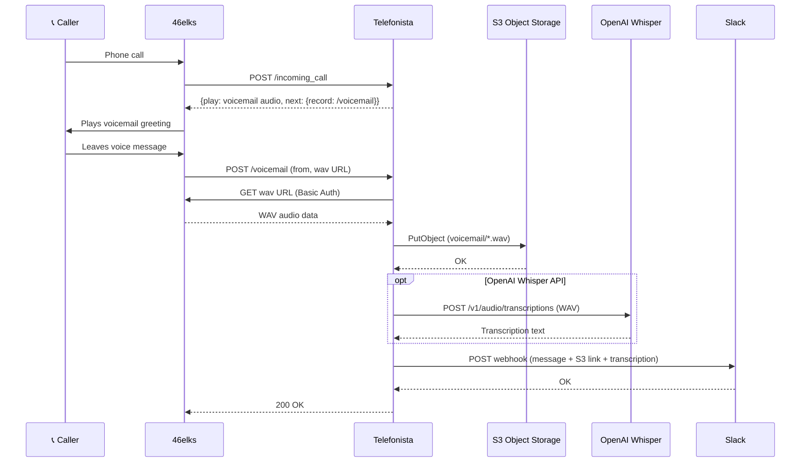

# Telefonista


Telefonista is a simple voicemail service that sends recorded messages to a
Slack channel (or user). It uses the [46elks](https://46elks.com/) telephony
API and stores recordings in S3-compatible object storage (e.g. Hetzner).
Optionally transcribes voicemails using OpenAI's Whisper API.

## How it works



## Environment variables

| Variable | Description | Required |
|---|---|---|
| `ELKS_USERNAME` | 46elks API username | Yes |
| `ELKS_PASSWORD` | 46elks API password | Yes |
| `S3_ACCESS_KEY` | Object storage access key | Yes |
| `S3_SECRET_KEY` | Object storage secret key | Yes |
| `S3_BUCKET_NAME` | Bucket name for storing recordings | Yes |
| `S3_ENDPOINT` | S3-compatible endpoint URL | Yes |
| `S3_REGION` | Storage region | Yes |
| `OPENAI_API_KEY` | OpenAI API key for Whisper transcription (omit to disable) | No |
| `SLACK_WEBHOOK_URL` | Slack incoming webhook URL | Yes |
| `SLACK_CHANNEL` | Slack channel to post to | No |
| `SLACK_NAME` | Bot display name in Slack | No |
| `SLACK_ICON_URL` | Bot icon URL in Slack | No |
| `HOST` | Public URL of this service (used for 46elks callbacks) | Yes |
| `VOICEMAIL_AUDIO` | URL of audio file to play to callers | Yes |
| `WEBHOOK_SECRET` | Shared secret for authenticating 46elks webhooks (query param `?secret=`) | No |
| `PORT` | HTTP port (default: `3000`) | No |

## Running

```sh
go build -o telefonista
./telefonista
```

## License

Telefonista is released under the [MIT License](http://www.opensource.org/licenses/MIT).
