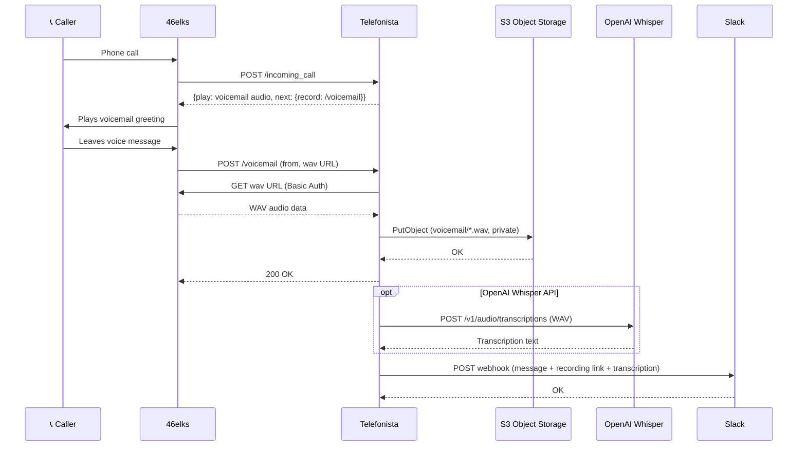

# Telefonista


Telefonista is a simple voicemail service that sends recorded messages to a
Slack channel (or user). It uses the [46elks](https://46elks.com/) telephony
API and stores recordings privately in S3-compatible object storage (e.g.
Hetzner).
Optionally transcribes voicemails using OpenAI's Whisper API.


## What you need

- Somewhere to host the service (I use [Runway](https://runway.horse)) 🇪🇺
- S3-compatible object storage (I use [Hetzner](https://www.hetzner.com)) 🇪🇺
- [Slack](https://slack.com/) (you need to create a custom App with an incoming web hook enabled)
- An [46elks](https://46elks.se) 🇪🇺 account and a phone number with `voice_call` set to `https://<WEBHOOK_USER>:<WEBHOOK_PASS>@<hostname>/incoming_call`
- An [OpenAI](https://platform.openai.com/) API key (if you want speech-to-text transcription)
- An audio file with your intro message (mp3, ogg or wav format)

## How it fits together


```mermaid
sequenceDiagram
      participant Caller as 📞 Caller
      participant 46elks
      participant Telefonista
      participant S3 as S3 Object Storage
      participant OpenAI as OpenAI Whisper
      participant Slack

      Caller->>46elks: Phone call
      46elks->>Telefonista: POST /incoming_call
      Telefonista-->>46elks: {play: voicemail audio, next: {record: /voicemail}}
      46elks->>Caller: Plays voicemail greeting
      Caller->>46elks: Leaves voice message
      46elks->>Telefonista: POST /voicemail (from, wav URL)
      Telefonista->>46elks: GET wav URL (Basic Auth)
      46elks-->>Telefonista: WAV audio data
      Telefonista->>S3: PutObject (voicemail/*.wav, private)
      S3-->>Telefonista: OK
      Telefonista-->>46elks: 200 OK
      opt OpenAI Whisper API
          Telefonista->>OpenAI: POST /v1/audio/transcriptions (WAV)
          OpenAI-->>Telefonista: Transcription text
      end
      Telefonista->>Slack: POST webhook (message + recording link + transcription)
      Slack-->>Telefonista: OK
```

46elks gets its response as soon as the recording is stored. Transcription and
the Slack notification happen in the background, so a slow transcription can't
time out the callback.

Recordings are uploaded without a public ACL. The Slack message links to
`<HOST>/recordings/<name>`, which streams the file from object storage. The
link's random name is what grants access, so treat it like a secret.
Recordings larger than Whisper's 25 MB upload limit are posted without a
transcription.

## Environment variables

| Variable | Description | Required |
|---|---|---|
| `ELKS_USERNAME` | 46elks API username | Yes |
| `ELKS_PASSWORD` | 46elks API password | Yes |
| `S3_ACCESS_KEY` | Object storage access key | Yes |
| `S3_SECRET_KEY` | Object storage secret key | Yes |
| `S3_BUCKET_NAME` | Bucket name for storing recordings | Yes |
| `S3_ENDPOINT` | S3-compatible endpoint URL | Yes |
| `S3_REGION` | Storage region | Yes |
| `OPENAI_API_KEY` | OpenAI API key for Whisper transcription (omit to disable) | No |
| `SLACK_WEBHOOK_URL` | Slack incoming webhook URL | Yes |
| `SLACK_CHANNEL` | Slack channel to post to | No |
| `SLACK_NAME` | Bot display name in Slack | No |
| `SLACK_ICON_URL` | Bot icon URL in Slack | No |
| `HOST` | Public URL of this service (used for 46elks callbacks and recording links) | Yes |
| `VOICEMAIL_AUDIO` | URL of audio file to play to callers | Yes |
| `WEBHOOK_USER` | Basic Auth username 46elks must use for webhooks | Yes |
| `WEBHOOK_PASS` | Basic Auth password 46elks must use for webhooks | Yes |
| `PORT` | HTTP port (default: `3000`) | No |

## Running

```sh
go build -o telefonista
./telefonista
```

## Development

```sh
make test       # go test -race
make lint       # golangci-lint (config in .golangci.yml)
make fmt        # gofmt -s + goimports via golangci-lint
make vulncheck  # govulncheck
```

## License

Telefonista is released under the [MIT License](http://www.opensource.org/licenses/MIT).
